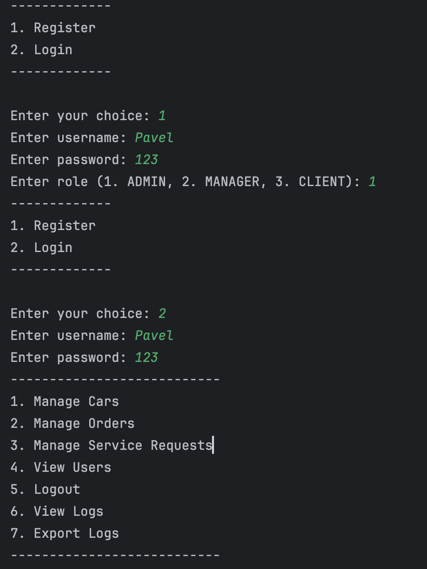

# CarShop

Приложение автосалона. Позволяет создавать базу автомобилей с описанием характеристик. Есть 3 роли пользователей с
различными правами доступа на действия над автомобилями.

1. [Туториал по взаимодействию с консолью приложения](#туториал-по-взаимодействию-с-консолью-приложения)

2. [Разворачивание БД в Docker](#команды-для-разворачивания-бд-в-docker)

3. [Миграция данных](#миграция-данных-liquibase)

## Туториал по взаимодействию с консолью приложения
Взаимодействие с приложением происходит через терминал путем ввода данных в ответ на вопрос терминала

1. Для начала взаимодействия необходимо зарегистрировать желаемое количество пользователей
2. После регистрации для получения доступа к главному меню приложения необходимо авторизоваться под сущействующим 
пользователем используя существующиую пару логин/пароль
3. После авторизации отображается главное меню с возможностью перехода в меню управления автомобилями, заказами
   

## Команды для разворачивания БД в docker
log/pass: car_shop_user/password
-  Для развертывания postgres БД нужно запустить команду docker-compose up -d
   Команда запускает контейнер с запущенной БД и использует логин и пароль указанные в переменных среды
- После разворачивания контейнера можно подключиться к БД по JDBC URL:
  jdbc:postgresql://localhost:5432/car_shop_db

## Миграция данных Liquibase
Миграция выполняется при старте приложения путём вызова LiquibaseRunner-ом конфигурационного файла changelog.xml
размещенного в ресурсах проекта. 
Переменные вынесены в файл application.properties содержащие:
    - url для коннекта с БД
    - логин БД
    - пароль БД
    - путь до главного файла миграции changelog.xml

Главный файл вызывает файлы миграции для создания таблиц, создания sequence и предзаполнения данными

